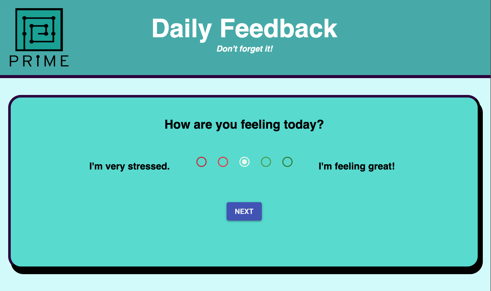
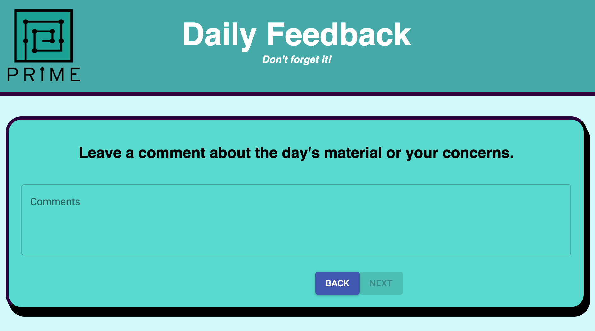
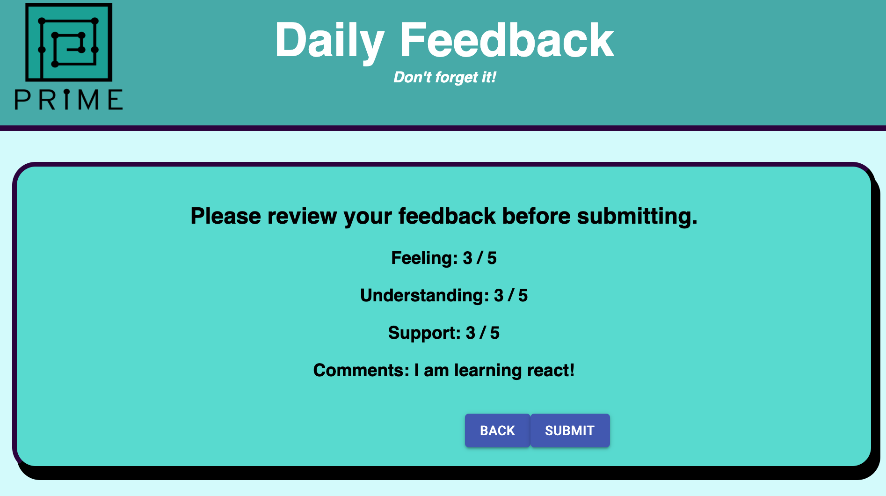
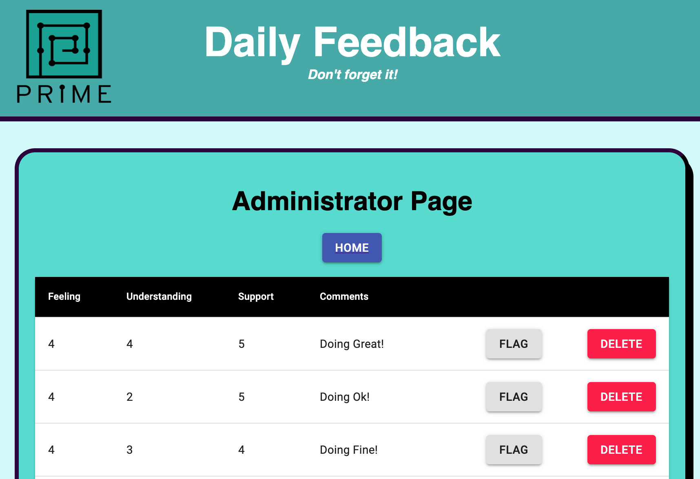

# Feedback Collection Form

Basic 'Daily Feedback' form built for Prime Digital Academy. This template asks participants about their feelings, understanding, support, and comments. It sends forms to an admin page to be viewed and edited. This can be view at http://localhost:3000/Admin. 

## Built With...

React, JavaScript, Node, Postgresl and Material-UI.

## Start up

Create your database and tables using the provided data.sql file.

1. npm install

2. npm run server

3. npm run client

## Screenshots

Radio switch question

Text field question

Submission review 
 

Admin page

